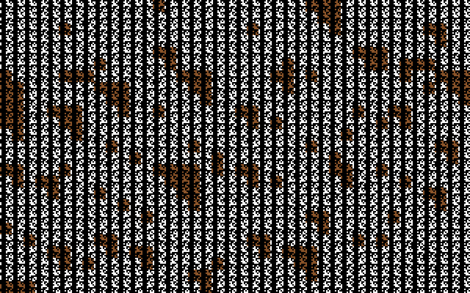
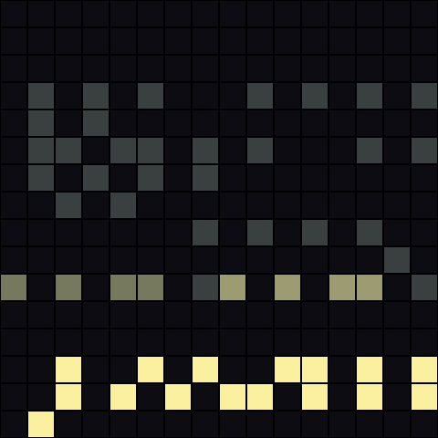

# A Mind Is Born — live in the browser

A from-scratch Commodore 64 emulator that runs **[*A Mind Is Born*](https://linusakesson.net/scene/a-mind-is-born/)** —
Linus Åkesson's legendary **256-byte** demo — byte-for-byte in your browser, with the music,
the visuals, **and** a live view of every byte as the CPU executes it.

No prebuilt emulator, no WebAssembly blob, no pre-rendered video or audio. The exact 256 bytes
are embedded in [`prg.js`](prg.js) (SHA-256 matches Linus's official release), and a hand-written
6502 + SID + VIC-II emulator brings them to life.



## Why this is interesting

*A Mind Is Born* is famous for its extreme coupling: there is no separate "music engine" and
"graphics engine." A single LFSR-driven clock feeds both the SID sound chip and the VIC-II video
matrix, so the generative melody and the flowing visuals are literally **the same numbers, read two
ways**. The background colours you see are SID register bytes copied straight into the VIC chip.

It also leans hard on **undocumented 6502 opcodes** (`lax`, `asr`/ALR, `sre`, `sbx`/AXS…),
**self-modifying code**, and an instruction you only reach by *jumping into the middle of another
one* (`.byte $2d` masquerading as `BIT abs`). All of that runs faithfully here.

### Watch the bytes execute

The right-hand panel shows all 256 bytes of zero page — where the program runs after its loader
copies itself there. Each byte flares bright the instant it executes, then fades like phosphor.
Colour them by execution frequency in a single frame and the program's anatomy appears:



- **Blazing band (bottom):** the main loop — ~288 executions per frame.
- **Dim cells (middle):** the interrupt handler — the music + colour engine, once per frame.
- **Dark cells:** data — the bass/melody tables, the SID shadow buffer, the script poke-table.

Only **54 of the 256 bytes** are code that runs in a steady frame.

## Run it

ES modules need to be served over HTTP (not `file://`):

```bash
python3 -m http.server 8256
# open http://127.0.0.1:8256
```

Click ▶ to start (browsers require a gesture before audio).

### Controls

- **speed** — `real-time + audio`, or slow it to `40000 / 4000 / 400 / 40` instructions per second, or
  `⏸ single-step`. Below real-time, audio mutes and a **live disassembly trace** scrolls one
  instruction at a time (real mnemonics, including the illegal opcodes), with the current byte
  outlined in the grid.
- **step ▸** — advance one instruction (in any slow / paused mode).
- **restart**, **volume**.

## How it works

| file | role |
|------|------|
| [`cpu.js`](cpu.js) | MOS 6510/6502 core — full legal set **plus** the undocumented opcodes the demo needs |
| [`sid.js`](sid.js) | 6581 SID — 3 voices (tri/saw/pulse/noise + ADSR), resonant filter, OSC3/ENV3 read-back |
| [`c64.js`](c64.js) | memory map, VIC-II extended-colour text rendering, 60 Hz IRQ, KERNAL traps |
| [`disasm.js`](disasm.js) | 6502 disassembler (incl. illegals) for the live trace |
| [`prg.js`](prg.js) | the exact 256 bytes, embedded |
| [`index.html`](index.html) | canvas + byte grid + trace + Web Audio |

Smoke test: `node test.mjs`.

### Fidelity

- **CPU and VIC-II are byte-exact** — the same instructions, the same screen.
- **The SID is a faithful approximation, not [reSID](https://en.wikipedia.org/wiki/ReSID).** The
  melody, bass, drums and drone are all there and recognizable, and the filter is modelled, but a
  real 6581's exact analog filter curve and combined-waveform quirks are not fully reproduced.
  Swapping in a reSID WASM core (keeping this VIC renderer) is the obvious path to note-perfect audio.

## Credits & licensing

- ***A Mind Is Born*** — program, music and concept © **[Linus Åkesson](https://linusakesson.net/)**,
  2017. The 256-byte binary is included here (in `prg.js` and `reference/`) purely to run and study
  it. All rights to the demo remain his.
- The annotated assembly in [`reference/a_mind_is_born.asm`](reference/a_mind_is_born.asm) was
  transcribed to 64tass and commented by **J.B. Langston**
  ([gist](https://gist.github.com/jblang/3eb7844b7a3134be243acaa57ce4dc9a)), from Linus's original.
- The **emulator code** (`cpu.js`, `sid.js`, `c64.js`, `disasm.js`, `index.html`) is original and
  released under the **MIT License** — see [`LICENSE`](LICENSE) and
  [`reference/ATTRIBUTION.md`](reference/ATTRIBUTION.md).

If you enjoy this, go watch the real thing on a real C64, and read Linus's
[write-up](https://linusakesson.net/scene/a-mind-is-born/) — it is a masterpiece.
